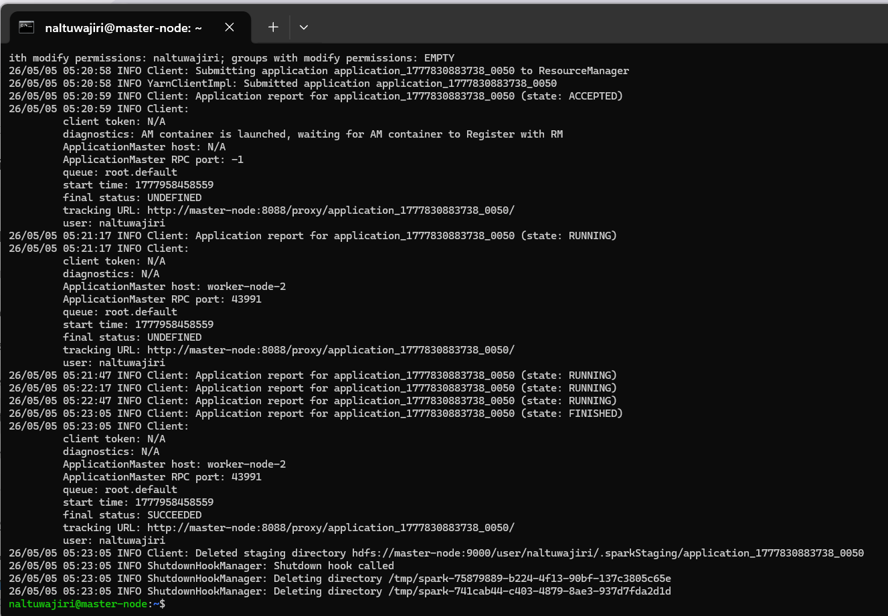

# SE446 – Milestone 2: Spark ML Pipeline

**Group 10**

---

## Team Members

| Name             | Student ID |
| ---------------- | ---------- |
| Alanoud Almeniya | 231385     |
| Lina Dardeer     | 231709     |
| Masa Abara       | 231837     |
| Noura Altuwaijri | 231222     |

---

## Executive Summary

This project analyzes the Chicago Crimes dataset using  Apache Spark. IN milestone 1 MapReduce was used for batch processing, while Spark enabled faster in-memory computation and machine learning modeling. The results show that Spark is more efficient, easier to use, and supports advanced analytics.

---

##  M1 vs M2 Comparison (Tasks 1–4)

### Task 1: Crime Type Analysis

| Rank | Crime Type          | MapReduce (M1) | Spark (M2) 
| ---- | ------------------- | -------------- | ---------- 
| 1    | THEFT               | 2054           | 2054       
| 2    | BATTERY             | 1728           | 1728      
| 3    | CRIMINAL DAMAGE     | 1062           | 1062       
| 4    | MOTOR VEHICLE THEFT | 948            | 948        
| 5    | ASSAULT             | 878            | 878        


---

###  Task 2: Location Hotspots

| Rank | Location    | MapReduce (M1) | Spark (M2) 
| ---- | ----------- | -------------- | ---------- 
| 1    | STREET      | 2737           | 2737       
| 2    | APARTMENT   | 1909           | 1909       
| 3    | RESIDENCE   | 1358           | 1358       
| 4    | SIDEWALK    | 536            | 536        
| 5    | PARKING LOT | 362            | 362        

---
### Task 3: Crime Trend Over Years

|Year|MapReduce (M1)|Spark (M2)|
|-|-|-|
|2001|4|4|
|2005|19|19|
|2010|5|5|
|2015|28|28|
|2017|49|49|


---

### Task 4: Arrest Rate Analysis

**Arrest rate in M1**
false 8717
true  1283

|Metric|MapReduce (M1)|Spark (M2)|
|-|-|-|
|Arrest Rate|\~0.1283|0.1283|

Arrest rate is \~12.83% in both implementations.

---

## Performance Comparison

|Feature|MapReduce|Spark|
|-|-|-|
|Speed|Slow|Fast|

**Conclusion:** Spark is faster, simpler, and more powerful.

---

## ML Results Summary

### Best Model: Random Forest

|Metric|Value|
|-|-|
|AUC-ROC|0.7526|
|Accuracy|0.8964|
|F1 Score|0.8675|
|Precision|0.8914|
|Recall|0.8964|

---

**Interpretation:**

* Random Forest performed best due to handling non-linear patterns
* `crime\\\_index` was the most important feature
* Logistic Regression performed worse due to linear assumptions


## Deployment Evidence

### Task 9: Local Execution


### Task 10: Cluster Execution -- Client Mode


### Task 11: Cluster Execution -- spark-submit



\---

## Member Contributions

|Member|Tasks|
|-|-|
|Alanoud Almeniya|Tasks 1–2|
|Lina Dardeer|Tasks 3–4|
|Masa Abara|Tasks 5–7|
|Noura Altuwaijri|Tasks 8–11|

\---

## Spark-Submit Terminal Output

```
naltuwajiri@master-node:~$ spark-submit  --master yarn  --deploy-mode cluster  --driver-memory 512m  --num-executors 1  --executor-memory 1g  --executor-cores 1  --conf spark.driver.maxResultSize=128m  --conf spark.pyspark.python=python3  --conf spark.yarn.maxAppAttempts=1  --conf spark.eventLog.enabled=true  --conf spark.eventLog.dir=hdfs:///user/naltuwajiri/spark-events  m2_spark_ml.py

26/05/05 05:20:13 WARN NativeCodeLoader: Unable to load native-hadoop library for your platform... using builtin-java classes where applicable

26/05/05 05:20:14 INFO DefaultNoHARMFailoverProxyProvider: Connecting to ResourceManager at master-node/134.209.172.50:8032

26/05/05 05:20:15 INFO Configuration: resource-types.xml not found

26/05/05 05:20:15 INFO ResourceUtils: Unable to find 'resource-types.xml'.

26/05/05 05:20:15 INFO Client: Verifying our application has not requested more than the maximum memory capability of the cluster (1536 MB per container)

26/05/05 05:20:15 INFO Client: Will allocate AM container, with 896 MB memory including 384 MB overhead

26/05/05 05:20:15 INFO Client: Setting up container launch context for our AM

26/05/05 05:20:15 INFO Client: Setting up the launch environment for our AM container

26/05/05 05:20:15 INFO Client: Preparing resources for our AM container

26/05/05 05:20:16 INFO Client: Uploading resource file:/opt/spark-3.5.4-bin-hadoop3/jars/kafka/commons-pool2-2.12.0.jar -> hdfs://master-node:9000/user/naltuwajiri/.sparkStaging/application_1777830883738_0050/commons-pool2-2.12.0.jar

26/05/05 05:20:17 INFO Client: Uploading resource file:/opt/spark-3.5.4-bin-hadoop3/jars/kafka/kafka-clients-3.9.0.jar -> hdfs://master-node:9000/user/naltuwajiri/.sparkStaging/application_1777830883738_0050/kafka-clients-3.9.0.jar

26/05/05 05:20:17 INFO Client: Uploading resource file:/opt/spark-3.5.4-bin-hadoop3/jars/kafka/spark-sql-kafka-0-10_2.12-3.5.4.jar -> hdfs://master-node:9000/user/naltuwajiri/.sparkStaging/application_1777830883738_0050/spark-sql-kafka-0-10_2.12-3.5.4.jar

26/05/05 05:20:18 INFO Client: Uploading resource file:/opt/spark-3.5.4-bin-hadoop3/jars/kafka/spark-token-provider-kafka-0-10_2.12-3.5.4.jar -> hdfs://master-node:9000/user/naltuwajiri/.sparkStaging/application_1777830883738_0050/spark-token-provider-kafka-0-10_2.12-3.5.4.jar

26/05/05 05:20:19 INFO Client: Uploading resource file:/home/naltuwajiri/m2_spark_ml.py -> hdfs://master-node:9000/user/naltuwajiri/.sparkStaging/application_1777830883738_0050/m2_spark_ml.py

26/05/05 05:20:19 INFO Client: Uploading resource file:/opt/spark-3.5.4-bin-hadoop3/python/lib/pyspark.zip -> hdfs://master-node:9000/user/naltuwajiri/.sparkStaging/application_1777830883738_0050/pyspark.zip

26/05/05 05:20:20 INFO Client: Uploading resource file:/opt/spark-3.5.4-bin-hadoop3/python/lib/py4j-0.10.9.7-src.zip -> hdfs://master-node:9000/user/naltuwajiri/.sparkStaging/application_1777830883738_0050/py4j-0.10.9.7-src.zip

26/05/05 05:20:21 INFO Client: Uploading resource file:/tmp/spark-9391b7c0-147b-4fb6-a9c5-faa2073d3fff/__spark_conf__229421958182067102.zip -> hdfs://master-node:9000/user/naltuwajiri/.sparkStaging/application_1777830883738_0050/__spark_conf__.zip

26/05/05 05:20:21 INFO SecurityManager: Changing view acls to: naltuwajiri

26/05/05 05:20:21 INFO SecurityManager: Changing modify acls to: naltuwajiri

26/05/05 05:20:21 INFO SecurityManager: Changing view acls groups to:

26/05/05 05:20:21 INFO SecurityManager: Changing modify acls groups to:

26/05/05 05:20:21 INFO SecurityManager: SecurityManager: authentication disabled; ui acls disabled; users with view permissions: naltuwajiri; groups with view permissions: EMPTY; users with modify permissions: naltuwajiri; groups with modify permissions: EMPTY

26/05/05 05:20:21 INFO Client: Submitting application application_1777830883738_0050 to ResourceManager

26/05/05 05:20:21 INFO YarnClientImpl: Submitted application application_1777830883738_0050

26/05/05 05:20:22 INFO Client: Application report for application_1777830883738_0050 (state: ACCEPTED)

26/05/05 05:20:22 INFO Client:
         client token: N/A
         diagnostics: AM container is launched, waiting for AM container to Register with RM
         ApplicationMaster host: N/A
         ApplicationMaster RPC port: -1
         queue: root.default
         start time: 1777958458559
         final status: UNDEFINED
         tracking URL: http://master-node:8088/proxy/application_1777830883738_0050/
         user: naltuwajiri
26/05/05 05:20:58 INFO Client: Submitting application application_1777830883738_0050 to ResourceManager

26/05/05 05:20:58 INFO YarnClientImpl: Submitted application application_1777830883738_0050

26/05/05 05:20:59 INFO Client: Application report for application_1777830883738_0050 (state: ACCEPTED)

26/05/05 05:20:59 INFO Client:
         client token: N/A
         diagnostics: AM container is launched, waiting for AM container to Register with RM
         ApplicationMaster host: N/A
         ApplicationMaster RPC port: -1
         queue: root.default
         start time: 1777958458559
         final status: UNDEFINED
         tracking URL: http://master-node:8088/proxy/application_1777830883738_0050/
         user: naltuwajiri

26/05/05 05:21:17 INFO Client: Application report for application_1777830883738_0050 (state: RUNNING)

26/05/05 05:21:17 INFO Client:
         client token: N/A
         diagnostics: N/A
         ApplicationMaster host: worker-node-2
         ApplicationMaster RPC port: 43991
         queue: root.default
         start time: 1777958458559
         final status: UNDEFINED
         tracking URL: http://master-node:8088/proxy/application_1777830883738_0050/
         user: naltuwajiri

26/05/05 05:21:47 INFO Client: Application report for application_1777830883738_0050 (state: RUNNING)

26/05/05 05:22:17 INFO Client: Application report for application_1777830883738_0050 (state: RUNNING)

26/05/05 05:22:47 INFO Client: Application report for application_1777830883738_0050 (state: RUNNING)

26/05/05 05:23:05 INFO Client: Application report for application_1777830883738_0050 (state: FINISHED)

26/05/05 05:23:05 INFO Client:
         client token: N/A
         diagnostics: N/A
         ApplicationMaster host: worker-node-2
         ApplicationMaster RPC port: 43991
         queue: root.default
         start time: 1777958458559
         final status: SUCCEEDED
         tracking URL: http://master-node:8088/proxy/application_1777830883738_0050/
         user: naltuwajiri

26/05/05 05:23:05 INFO Client: Deleted staging directory hdfs://master-node:9000/user/naltuwajiri/.sparkStaging/application_1777830883738_0050

26/05/05 05:23:05 INFO ShutdownHookManager: Shutdown hook called

26/05/05 05:23:05 INFO ShutdownHookManager: Deleting directory /tmp/spark-75879889-b224-4f13-90bf-137c3805c65e

26/05/05 05:23:05 INFO ShutdownHookManager: Deleting directory /tmp/spark-741cab44-c403-4879-8ae3-937d7fda2d1d

naltuwajiri@master-node:~$
\---

